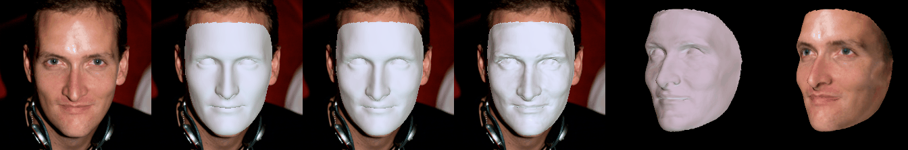

# HRN

### [Project](https://younglbw.github.io/HRN-homepage/) | [Paper](https://arxiv.org/abs/2302.14434) | [ModelScope](https://www.modelscope.cn/models/damo/cv_resnet50_face-reconstruction/summary)

[](https://paperswithcode.com/sota/3d-face-reconstruction-on-realy?p=a-hierarchical-representation-network-for) [](https://paperswithcode.com/sota/3d-face-reconstruction-on-realy-side-view?p=a-hierarchical-representation-network-for)

This repository is the official implementation of [HRN](https://arxiv.org/abs/2302.14434).


> **[A Hierarchical Representation Network for Accurate and Detailed Face Reconstruction from In-The-Wild Images](https://arxiv.org/abs/2302.14434)** </br>
> Biwen Lei, Jianqiang Ren, Mengyang Feng, Miaomiao Cui, Xuansong Xie</br>
> In CVPR 2023</br>
> [DAMO Academy, Alibaba Group](https://damo.alibaba.com), Hangzhou, China


We present a novel hierarchical representation network (HRN) to achieve accurate and detailed face reconstruction from a single image. Specifically, we implement the geometry disentanglement and introduce the hierarchical representation to fulfill detailed face modeling.

## News

* [04/19/2023] The source codes are available!
* [03/01/2023] HRN achieved top-1 results on single image face reconstruction benchmark [REALY](https://realy3dface.com/)!
* [02/28/2023] Paper [HRN](https://arxiv.org/abs/2302.14434) released!

## Getting Started
Clone the repo:
  ```bash
  git clone https://github.com/youngLBW/HRN.git
  cd HRN
  ```  

### Requirements
**This implementation is only tested under Ubuntu/CentOS environment with Nvidia GPUs and CUDA installed.**

* Python >= 3.6
* PyTorch >= 1.6
* Basic requirements, you can run 
  ```bash
  conda create -n HRN python=3.6
  source activate HRN
  pip install -r requirements.txt
  ```
* [pytorch3d](https://github.com/facebookresearch/pytorch3d/blob/main/INSTALL.md)
* [nvdiffrast](https://nvlabs.github.io/nvdiffrast/#installation)
  ```bash
  cd ..
  git clone https://github.com/NVlabs/nvdiffrast.git
  cd nvdiffrast
  pip install .
  
  apt-get install freeglut3-dev
  apt-get install binutils-gold g++ cmake libglew-dev mesa-common-dev build-essential libglew1.5-dev libglm-dev
  apt-get install mesa-utils
  apt-get install libegl1-mesa-dev 
  apt-get install libgles2-mesa-dev
  apt-get install libnvidia-gl-525
  ```

### Testing with pre-trained network
1. Prepare assets and pretrained models
   
    Please refer to this [README](https://github.com/youngLBW/HRN/blob/main/assets/README.md) to download the assets and pretrained models.


2. Run demos
   
    a. single-view face reconstruction 
    ```bash
    CUDA_VISIBLE_DEVICES=0 python demo.py --input_type single_view --input_root ./assets/examples/single_view_image --output_root ./assets/examples/single_view_image_results
    ```

    b. multi-view face reconstruction  
    ```bash
    CUDA_VISIBLE_DEVICES=0 python demo.py --input_type multi_view --input_root ./assets/examples/multi_view_images --output_root ./assets/examples/multi_view_image_results
    ```   
    where the "input_root" saves the multi-view images of the same subject. 
 

3. inference time
   
    The pure inference time of HRN for single view reconstruction is less than 1 second. We added some visualization codes to the pipeline, resulting in an overall time of about 5 to 10 seconds. The multi-view reconstruction of MV-HRN involves the fitting process and the overall time is about 1 minute.

### Training
We haven't released the training code yet.

## Note
This implementation has made a few changes on the basis of the original HRN to improve the effect and robustness:

- Introduce a valid mask to alleviate the interference caused by the occlusion of objects such as hair.
- Re-implement texture map generation and re-alignment module, which is faster than the original implementation.
- Introduce two trainable parameters α and β to improve the training stability at the beginning stage.


## Results





## Contact
If you have any questions, please contact Biwen Lei (biwen1996@gmail.com).

## Citation
If you use our work in your research, please cite our publication:
```
@misc{lei2023hierarchical,
      title={A Hierarchical Representation Network for Accurate and Detailed Face Reconstruction from In-The-Wild Images}, 
      author={Biwen Lei and Jianqiang Ren and Mengyang Feng and Miaomiao Cui and Xuansong Xie},
      year={2023},
      eprint={2302.14434},
      archivePrefix={arXiv},
      primaryClass={cs.CV}
}
```

## Acknowledgements
There are some functions or scripts in this implementation that are based on external sources. We thank the authors for their excellent works.  
Here are some great resources we benefit:  
- [Deep3DFaceRecon_pytorch](https://github.com/sicxu/Deep3DFaceRecon_pytorch) for the base model of HRN.
- [DECA](https://pytorch3d.org/), [Pytorch3D](https://github.com/facebookresearch/pytorch3d), [nvdiffrast](https://github.com/NVlabs/nvdiffrast) for rendering.
- [retinaface](https://github.com/biubug6/Pytorch_Retinaface) for face detector.
- [face-alignment](https://github.com/1adrianb/face-alignment) for cropping.
- [FAN](https://github.com/1adrianb/2D-and-3D-face-alignment) for landmark detection.
- [Liu](https://arxiv.org/abs/2004.04955) for face mask.
- [face3d](https://github.com/yfeng95/face3d) for generating face albedo map.

We would also like to thank these great datasets and benchmarks that allow us to easily perform quantitative and qualitative comparisons :)  
- [REALY](https://realy3dface.com/)
- [facescape](https://github.com/zhuhao-nju/facescape)
- [ESRC](http://pics.stir.ac.uk/ESRC/)
- [MICC](http://www.micc.unifi.it/)
